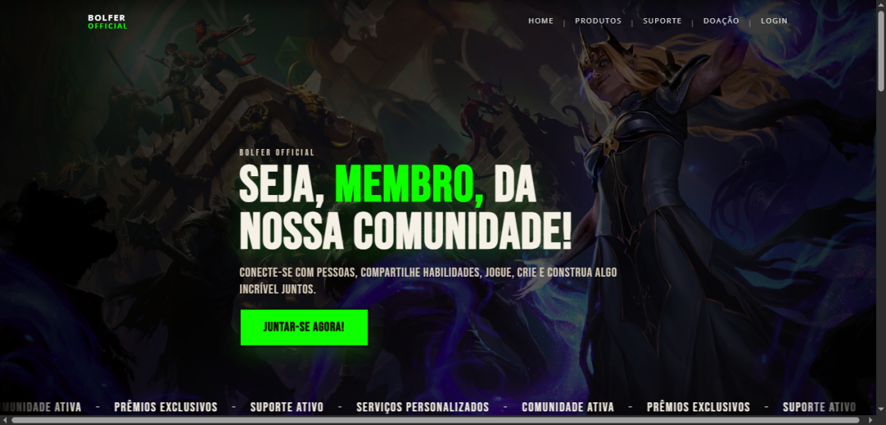
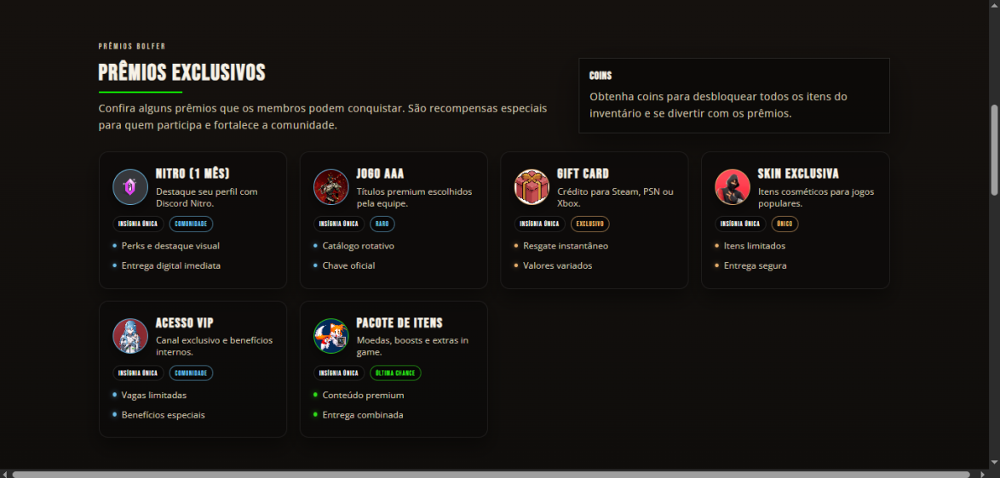
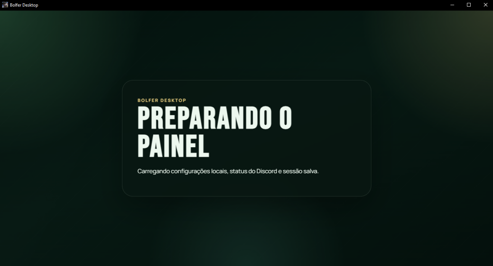

# Bolfer Official

Plataforma completa para comunidade, loja digital, administração interna, aplicativo desktop e automação para Discord.

O **Bolfer Official** não é apenas um site, um painel administrativo ou um bot. O projeto reúne diferentes aplicações que trabalham em conjunto para transformar uma comunidade em uma operação organizada, escalável e fácil de administrar.

A proposta é centralizar vendas, usuários, gestão operacional e interação com a comunidade em um único ecossistema.

---

# Visão Geral

```text
bolferofficial/
├── bolfer-site/   Site público + painel + API
├── bolfer-app/    Aplicativo desktop (Electron + React)
├── bot-bolfer/    Bot Discord (Node.js)
└── README.md
```

Cada módulo pode funcionar separadamente, mas o valor real aparece quando eles trabalham juntos.

## Fluxo Geral

```text
Usuário
↓
Site
↓
Compra • Área do usuário • Pedidos

Equipe
↓
Painel Web / Desktop
↓
Operação e gestão

Comunidade
↓
Bot Discord
↓
Eventos • Comunicação • Automação
```

---

# Arquitetura

## bolfer-site

Aplicação principal responsável pela experiência pública e operação administrativa.

### Recursos

- Página inicial
- Produtos e serviços
- Sistema de doações
- Checkout Mercado Pago
- Área do usuário
- Login e cadastro
- Verificação por e-mail
- 2FA
- Inventário e VIP
- Painel administrativo
- API Desktop

### Estrutura

```text
bolfer-site/
├── app/
│   ├── Controllers/
│   ├── Repositories/
│   ├── Services/
│   ├── Support/
│   └── Views/
├── public_html/
├── sql/
├── deploy/
├── .env.example
└── index.php
```

---

## bolfer-app

Aplicativo desktop opcional desenvolvido com Electron + React.

### Recursos

- Login integrado
- Dashboard
- Gestão operacional
- Logs
- Convites
- Rich Presence opcional

```text
bolfer-app/
├── electron/
├── src/
├── config/
├── scripts/
└── vite.config.js
```

---

## bot-bolfer

Bot Discord com discord.js v14.

### Recursos

- Setup de painéis
- Eventos
- Enquetes
- Embeds
- Armazenamento local

```text
bot-bolfer/
├── src/
├── data/
└── package.json
```

---

# Filosofia do Projeto

O projeto foi construído com foco em:

- Clareza operacional
- Segurança por padrão
- Escalabilidade
- Separação de responsabilidades
- Experiência consistente

Práticas adotadas:

- `.env`
- Backend como fonte de verdade
- Logs administrativos
- Tokens protegidos
- CSRF
- Módulos desacoplados

---

# Requisitos

- PHP 8.2+
- MySQL ou MariaDB
- Node.js 18+
- npm
- Discord App (opcional)
- Mercado Pago (opcional)
- SMTP (opcional)

---

# Configuração Inicial

```powershell
Copy-Item bolfer-site\.env.example bolfer-site\.env
Copy-Item bolfer-app\.env.example bolfer-app\.env
Copy-Item bot-bolfer\.env.example bot-bolfer\.env
```

Arquivos:

- `bolfer-site/.env`
- `bolfer-app/.env`
- `bot-bolfer/.env`

---

# Rodando o Site

```powershell
cd bolfer-site
mysql -u root -p < sql/schema.sql
php -S localhost:8000 -t public_html public_html/router.php
```

Acesso:

```text
http://localhost:8000
```

Admin:

```env
ALLOW_ADMIN_SETUP=1
```

Após finalizar:

```env
ALLOW_ADMIN_SETUP=0
```

---

# Rodando o Desktop

```powershell
cd bolfer-app
npm install
npm run dev
```

Build:

```powershell
npm run build
npm run dist:win
```

---

# Rodando o Bot

```powershell
cd bot-bolfer
npm install
npm run check
npm start
```

Variáveis mínimas:

```env
DISCORD_TOKEN=
CHANNEL_ID=
REGRAS_URL=
CARGOS_URL=
SUPORTE_URL=
BEM_VINDO_URL=
```

Permissões:

- View Channels
- Send Messages
- Embed Links
- Attach Files
- Manage Messages
- Slash Commands

---

# Banco de Dados

```text
bolfer-site/sql/schema.sql
bolfer-site/sql/changes_only.sql
deploy_patch_products_api/
```

---

# Segurança

Nunca publique:

- `.env`
- Tokens
- Senhas
- Logs
- Backups
- Builds

Checklist:

- Revogar tokens antigos
- Revisar histórico Git
- Configurar HTTPS
- Validar permissões

---

# Deploy

Arquivos:

```text
deploy/apache.conf
deploy/nginx.conf
prepare_kinghost_ftp.ps1
```

Antes de produção:

- APP_URL
- Banco real
- SMTP
- Mercado Pago
- HTTPS
- ALLOW_ADMIN_SETUP=0

---

# Comandos Úteis

Site:

```powershell
php -S localhost:8000 -t public_html public_html/router.php
```

Desktop:

```powershell
npm run dev
```

Bot:

```powershell
npm run check
npm start
```

---

# Guia Para Novos Desenvolvedores

Ordem recomendada:

1. README.md
2. .env.example
3. schema.sql
4. index.php
5. app-utils.js
6. config/index.js

---

# Estado Atual

Monorepo simples.

Cada aplicação possui:

- Dependências próprias
- Ambiente próprio
- Deploy independente

---

# Nota Final

Bolfer Official busca equilibrar presença visual forte com ferramentas reais de operação.

Construa pensando em quem administra, mas sem esquecer quem usa.





# Equipe

## Liderança e Produto
**Carlos**  
Idealização do projeto • Arquitetura • Design do sistema

## Desenvolvimento
[**João**](https://github.com/joaoweslen)
Desenvolvimento • Suporte

**Bruno**  
Desenvolvimento Jr

## Operação e Crescimento
**Wolf**  
Marketing Digital

**Marcus**  
Marketing • Financeiro

---

Obrigado a todos que participaram da construção do Bolfer Official ❤️
